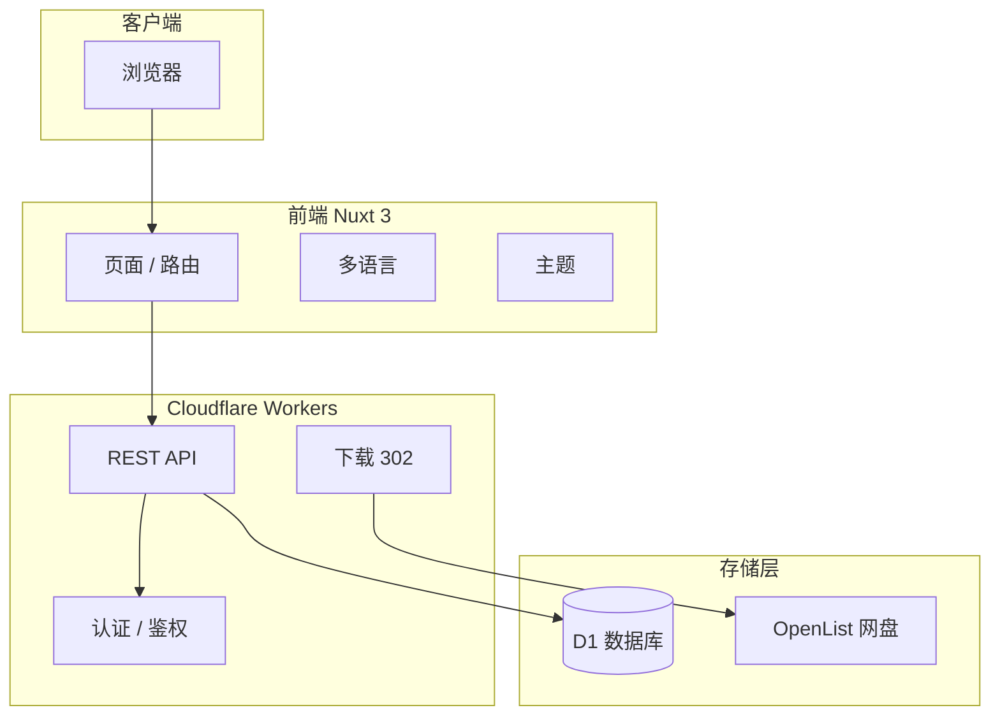

# SoftCloud 架构与开发顺序

> 架构决策 + 开发阶段排序，指导实施顺序。

---

## 1. 架构图

---

## 2. 分层职责

| 层 | 职责 |
|----|------|
| **前端 (Nuxt 3)** | 展示、路由、i18n、主题；不直连 D1/OpenList |
| **Workers** | 业务逻辑、鉴权、下载跳转；暴露 REST API |
| **D1** | 结构化数据（users、software、downloads 等） |
| **OpenList** | 大文件存储、WebDAV 上传、分享链接生成 |

---

## 3. 认证体系

| 场景 | 方式 |
|------|------|
| 用户登录 | JWT + HttpOnly Cookie `auth_token` |
| 管理接口 | JWT（已登录且 `users.is_admin=1`）或 `Authorization: Bearer <ADMIN_TOKEN>` / `admin_tokens` 表 |

---

## 4. 开发顺序

### 4.1 按结构划分（架构 → 数据库 → 部署 → 前台 → 存储 → 测试 → 后台）

| 顺序 | 阶段 | 主要内容 | 开发文档 |
|------|------|----------|----------|
| 1 | 架构 | 分层约定、API 合约、认证体系 | 本文、[04-API合约](./04-API合约.md) |
| 2 | 数据库 | users/software/downloads、schema 初始化 | [05-02-数据库与核心API](./05-02-数据库与核心API.md) |
| 3 | 部署 | 本地环境 + 生产部署（含 GitHub Actions 一键部署） | [05-01-环境与基础设施](./05-01-环境与基础设施.md)、[07-Cloudflare部署](./07-Cloudflare部署.md) |
| 4 | 前台 | 软件列表、详情、下载、搜索、i18n、主题 | [05-02](./05-02-数据库与核心API.md)（前端部分） |
| 5 | 存储 | storage_backends、software_files、OpenList 集成 | [05-05-存储后端与OpenList](./05-05-存储后端与OpenList.md)、[08-OpenList集成](./08-OpenList集成.md) |
| 6 | 测试 | 接口测试、E2E（预留） | [05-07-测试](./05-07-测试.md) |
| 7 | 后台 | 软件 CRUD、投稿审核、更新源、统计 | [05-03](./05-03-软件管理闭环.md)、[05-04](./05-04-用户投稿与审核.md)、[05-06](./05-06-自动升级与扩展.md) |

### 4.2 按阶段编号（05-01～05-07）

| 编号 | 名称 | 主要内容 | 开发文档 |
|------|------|----------|----------|
| 05-01 | 环境与基础设施 | D1 创建、schema 初始化、Wrangler 配置、Nuxt 启动、OpenList 部署 | [05-01-环境与基础设施](./05-01-环境与基础设施.md) |
| 05-02 | 数据库与核心 API | users/software/downloads、auth、GET/POST software、download 302 | [05-02-数据库与核心API](./05-02-数据库与核心API.md) |
| 05-03 | 软件管理闭环 | admin 增删改查、编辑表单、软删除、DOWNLOAD_URL_MISSING | [05-03-软件管理闭环](./05-03-软件管理闭环.md) |
| 05-04 | 用户投稿与审核 | software_submissions、submit/review API、前端投稿页与审核 UI | [05-04-用户投稿与审核](./05-04-用户投稿与审核.md) |
| 05-05 | 存储后端与 OpenList | storage_backends、software_files、后台 UI、OpenList 路径约定 | [05-05-存储后端与OpenList](./05-05-存储后端与OpenList.md) |
| 05-06 | 自动升级与扩展 | software_sources、scheduled、批量导入脚本、统计 API | [05-06-自动升级与扩展](./05-06-自动升级与扩展.md) |
| 05-07 | 测试 | 接口测试、E2E（预留） | [05-07-测试](./05-07-测试.md) |

---

## 5. 架构决策记录（ADR）

| 决策 | 说明 |
|------|------|
| 前端为 Nuxt 3 | 部署于 Cloudflare Pages，与 Workers 分离 |
| 管理认证 | 优先 JWT Cookie（已登录管理员），其次 Bearer ADMIN_TOKEN |
| 软件删除 | 使用软删除（is_deleted），不物理删除 |
| API 合约 | 先文档化路径、请求/响应、错误码，再实现；详见 [04-API合约](./04-API合约.md) |
| 图片存储 | 另建独立 GitHub 仓库，不放入主代码库；见下节 |

---

## 6. 图片存储约定

软件图标、截图等图片统一存放在**单独的 GitHub 仓库**（如 `softcloud-assets`），不放入主代码库。

| 项目 | 说明 |
|------|------|
| **存放内容** | 软件图标 (icons)、截图 (screenshots)、其他展示用图片 |
| **访问方式** | 启用 GitHub Pages，或通过 jsDelivr：`https://cdn.jsdelivr.net/gh/org/softcloud-assets@main/icons/xxx.png` |
| **SoftCloud 中** | `icon_url`、`screenshot_url` 等字段填写上述 CDN/Pages 完整 URL |
| **目录建议** | `icons/`、`screenshots/` 按类型分目录，便于管理 |

**好处**：主仓库轻量、图片独立 CDN、权限可分开管理。

---

## 7. 文档索引与阅读顺序

**阅读顺序**：01 → 02 → 03 → **04**（API 合约，实施前先读）→ 05-01～05-07 → 06 → 07 / 08

| 文档 | 用途 |
|------|------|
| [01-软件功能简介](./01-软件功能简介.md) | 产品级功能概览 |
| [02-软件需求设计分析书](./02-软件需求设计分析书.md) | 需求与高层设计 |
| [03-架构与开发顺序](./03-架构与开发顺序.md) | 本文件 |
| [04-API合约](./04-API合约.md) | API 合约（实施 05-xx 前必读） |
| [05-01～05-07](./05-01-环境与基础设施.md) | 按阶段的开发文档 |
| [06-架构待办与路线图](./06-架构待办与路线图.md) | 功能优先级、实施状态与建议动作（日常迭代用） |
| [07-Cloudflare部署](./07-Cloudflare部署.md) | 生产部署与 GitHub Actions 一键部署 |
| [08-OpenList集成](./08-OpenList集成.md) | OpenList 集成说明 |
